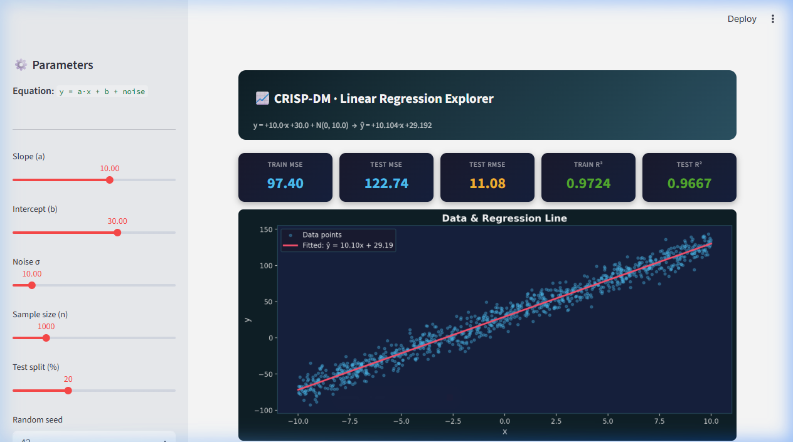

# 📈 CRISP-DM · Linear Regression Explorer

An interactive **Streamlit** app that walks through the complete [CRISP-DM](https://en.wikipedia.org/wiki/Cross-industry_standard_process_for_data_mining) data mining framework applied to a simple linear regression problem — with live, adjustable parameters.



---

## 🚀 Live Demo

> **[▶ Open on Streamlit Cloud](https://roy12358-aiot-dic7.streamlit.app)**

---

## ✨ Features

| | |
|---|---|
| 🎚️ **Interactive sliders** | Adjust slope `a`, intercept `b`, noise σ, sample size `n`, test split %, and random seed |
| ⚡ **Real-time updates** | Every slider change re-generates data, re-trains the model, and updates all outputs instantly |
| 📊 **Live metrics** | Train/Test MSE, RMSE, Train/Test R² displayed as metric cards |
| 📉 **Regression chart** | Scatter plot (blue) + fitted regression line (red) with learned equation |
| 📚 **CRISP-DM phases** | All 6 phases documented in collapsible expanders |

---

## 🧠 CRISP-DM Framework

| Phase | Content |
|-------|---------|
| 1 · Business Understanding | Problem definition, equation display |
| 2 · Data Understanding | Dataset preview, descriptive statistics |
| 3 · Data Preparation | Train/test split summary |
| 4 · Modelling | OLS regression, learned vs true coefficients |
| 5 · Evaluation | MSE, RMSE, R² on train and test sets |
| 6 · Deployment | Interactive dashboard (this app) |

---

## 🔢 The Model

Data is generated as:

```
y = a·x + b + ε,    x ~ Uniform(-10, 10),    ε ~ N(0, σ)
```

Default values: `a = 10`, `b = 30`, `σ = 10`, `n = 1000`

`sklearn.linear_model.LinearRegression` (OLS) is used to recover `a` and `b` from the noisy observations.

---

## 🛠 Local Setup

```bash
# Clone
git clone https://github.com/roy12358/AIOT-DIC7.git
cd AIOT-DIC7

# Install dependencies
pip install -r requirements.txt

# Run
streamlit run app.py
```

Then open **http://localhost:8501** in your browser.

---

## 📦 Dependencies

```
streamlit
scikit-learn
matplotlib
pandas
numpy
scipy
```

---

## 📁 Project Structure

```
AIOT-DIC7/
├── app.py            # Streamlit main app
├── requirements.txt  # Python dependencies
├── screenshot.png    # App screenshot
├── devlog.md         # Development log (v1 → v5)
├── conversation.md   # Conversation & change history
└── README.md
```

---

## 📝 License

MIT
